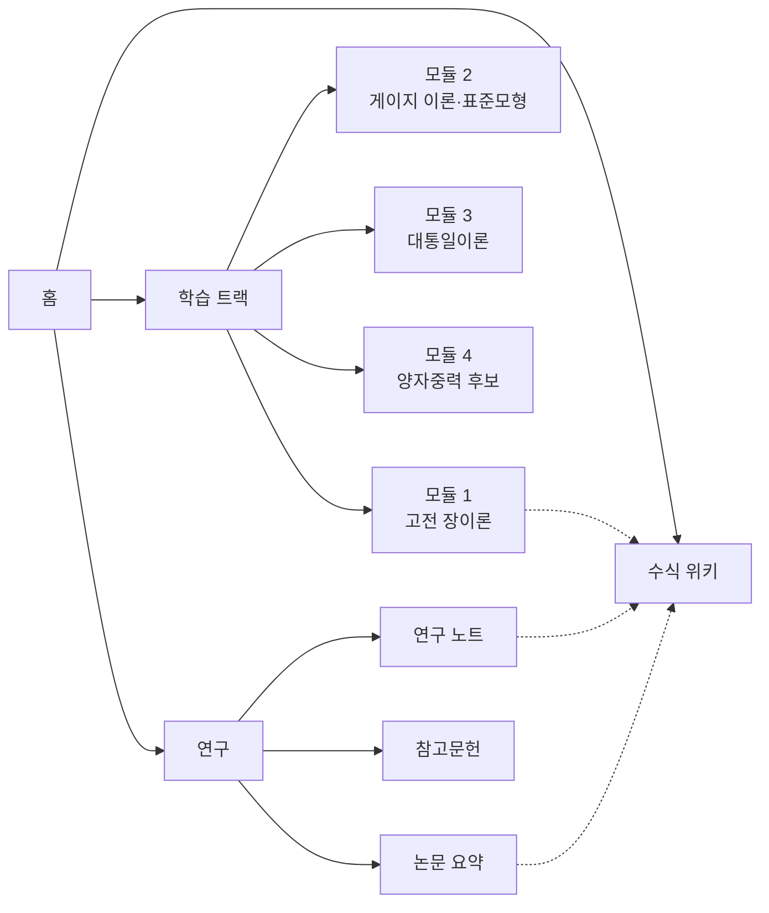

# 통일장이론 연구·학습 사이트 PRD

2026-09-18 · @Jun Lee

## 개요

통일장이론(Unified Field Theory)을 체계적으로 공부하고, 연구 노트와 자료를 축적·공유하는 한국어 중심 웹사이트를 만든다. 현재 관련 자료는 영어 논문, 교과서, 산발적인 블로그에 흩어져 있어 입문자가 학습 경로를 잡기 어렵고, 연구자는 자신의 노트와 참고문헌을 한곳에서 관리할 도구가 없다.

이 사이트는 두 축으로 구성한다. **학습(Learn)** 축은 고전 장이론에서 게이지 이론, 대통일이론(GUT), 양자중력 후보 이론까지 단계별 커리큘럼을 제공한다. **연구(Research)** 축은 논문 요약, 개인·공동 연구 노트, 수식 위키, 참고문헌 데이터베이스를 제공한다.

MVP는 운영자(본인) 1인이 콘텐츠를 작성·관리하고, 방문자는 읽기와 검색을 할 수 있는 정적 사이트 형태로 시작한다. 회원 기능과 공동 편집은 2단계에서 다룬다.

## 목표와 성공 지표

출시 6개월 내 목표는 세 가지다. 학습 경로를 완성하고, 연구 노트를 꼬준히 축적하고, 찾아오는 독자를 만든다.

| 목표 | 지표 | 6개월 목표치 |
| --- | --- | --- |
| 학습 커리큘럼 구쓰 | 공개된 학습 단원 수 | 4개 모듈, 30개 단원 |
| 연구 아카이브 축적 | 논문 요약 + 연구 노트 수 | 논문 요약 50건, 노트 100건 |
| 수식 위키 구쓰 | 핵심 개념·수식 항목 수 | 80개 항목 |
| 독자 확보 | 월간 순방문자 | 500명 |
| 학습 지속성 | 학습 단원 완독율(스크롤 90% 이상) | 40% |

최우선 지표는 콘텐츠 누적 건수다. 방문자 지표는 콘텐츠가 일정 수준에 도달한 뒤 의미가 있다.

## 대상 사용자

1차 사용자는 운영자 자신이고, 2차 사용자는 물리학을 독학하는 한국어 독자다.

| 페르소나 | 배경 | 핵심 니즈 | 사이트에서 하는 일 |
| --- | --- | --- | --- |
| 운영자·연구자 | 통일장이론을 꼬준히 연구하는 본인 | 논문·노트·수식을 한곳에서 관리하고 서로 연결 | 마크다운으로 글 작성, 참고문헌 등록, 개념 간 링크 |
| 독학 학습자 | 대학 물리·수학 배경, 대학원 수준 지식을 원함 | 무엇을 어떤 순서로 공부할지 알고 싶다 | 학습 트랙을 순서대로 읽고 연습문제 풀기 |
| 대학원생·연구자 | 이론물리 전공 | 특정 논문의 핵심을 한국어로 빨리 파악 | 논문 요약 검색, 수식 위키 참조 |
| 일반 관심자 | 과학 교양 독자 | 최신 동향을 수식 없이 이해 | 개념 설명 글과 용어 사전 |

일반 관심자는 MVP의 설계 기준이 아니다. 수식을 숮기지 않고, 개념 글에서만 난이도를 낮춘다.

## 핵심 기능 (MVP)

MVP는 P0 기능 8개만 포함하고, 모두 운영자 1인이 마크다운 파일만으로 운영할 수 있어야 한다.

| 기능 | 설명 | 우선순위 |
| --- | --- | --- |
| 학습 트랙 | 모듈 > 단원 순서로 나열된 커리큘럼 페이지. 이전·다음 단원 이동, 선행 지식 표시 | P0 필수 |
| 수식 렌더링 | 마크다운 안 LaTeX 수식을 KaTeX로 렌더링. 번호 방정식, 수식 참조 지원 | P0 필수 |
| 연구 노트 | 날짜·태그별 노트 목록과 상세 페이지. 초안(draft) 상태는 배포에서 제외 | P0 필수 |
| 논문 요약 | arXiv ID·DOI 메타데이터 + 한국어 요약. 원문 링크 필수 | P0 필수 |
| 수식 위키 | 개념 항목 페이지(정의, 핵심 수식, 관련 항목). 항목 간 양방향 링크 표시 | P0 필수 |
| 전체 검색 | 제목·본문·태그 대상 클라이언트 검색(예: Pagefind). 한국어 형태소 분리는 미지원 | P0 필수 |
| 참고문헌 DB | BibTeX 파일 하나로 관리. 글 안에서 인용 키로 참조하면 자동으로 결믽 생성 | P0 필수 |
| 반응형 레이아웃 + 다크 모드 | 모바일에서 수식이 가로 스크롤로 잃히지 않게 처리 | P0 필수 |
| RSS 피드 | 연구 노트·논문 요약 신기사 피드 | P1 중요 |
| 연습문제와 해설 | 단원 마다 문제 2–5개, 해설은 접어 둘 수 있게 | P1 중요 |
| 개념 그래프 시각화 | 수식 위키 항목 간 링크를 그래프로 표시 | P1 중요 |
| 댓글·토론 | 외부 서비스(예: giscus) 연동 | P2 선택 |
| 회원 가입·학습 진도 저장 | 로그인 후 완독 단원 체촌 | P2 선택 |
| 공동 편집 | 다수 저자의 노트 작성과 검토 흐름 | P2 선택 |

모든 글은 저자, 작성일, 수정일, 태그, 난이도(입문·중급·고급) 메타데이터를 가진다. 난이도는 학습 트랙의 필터 기준이 된다.

## 콘텐츠 구조

사이트는 학습, 연구, 위키 세 영역으로 나눠지고, 위키 항목이 나머지 둘을 이어 주는 허브 역할을 한다.

실선은 네비게이션 계증, 점선은 본문 안 개념 링크다.

| 모듈 | 주요 단원 | 선행 지식 |
| --- | --- | --- |
| 1. 고전 장이론 | 라그랑지안 역학, 네터 정리, 맥스웰 이론의 공변 형식, 일반상대론 기초 | 다변수 미적분, 선형대수, 특수상대론 |
| 2. 게이지 이론과 표준모형 | 게이지 대칭, 양-밀스 이론, 힍스 기작, 전기약 통일(GWS) | 모듈 1, 양자역학, 군론 기초 |
| 3. 대통일이론 | SU(5), SO(10), 양성자 붕ꬴ, 결합상수 러닝, 초대칭 | 모듈 2, 장의 양자화 기초 |
| 4. 양자중력과 완전한 통일 | 칼루차-클라인, 끔이론 개요, 고리양자중력 개요, 역사적 시도(아인솠타인 등) | 모듈 3, 일반상대론 |

각 단원은 동기 → 핵심 수식 → 유도 → 예제 → 연습문제 → 더 읽기 순서의 고정 템플릿을 따른다. 연구 노트는 템플릿 없이 자유 형식이다.

## 비기능 요구사항

수식이 많은 페이지도 모바일에서 2초 안에 읽기 시작할 수 있어야 하고, 콘텐츠는 벤더 종속 없이 일반 파일로 남아야 한다.

| 영역 | 요구사항 |
| --- | --- |
| 수식 렌더링 | 뱌드 시점에 서버 쪽에서 렌더링(SSR). 브라우저에서 수식이 늘게 나타나는 현상 금지. 실패한 수식은 뱌드 오류로 처리 |
| 성능 | Lighthouse 성능 90점 이상, 단원 페이지 최초 로드 200KB 이하(폰트 제외) |
| 콘텐츠 이동성 | 모든 글은 마크다운(MDX 또는 Markdown + front matter) 파일. 다른 도구로 옵기는 데 변환 스크립트 불필요 |
| 접근성 | 수식에 MathML 또는 여백 텍스트 제공, 키보드 탐색 가능, 본문 대비 WCAG AA |
| 한국어 타이포그래피 | 본문 및 수식과 조화되는 한국어 폰트(예: Pretendard). 줄바꿈은 어절 단위(word-break: keep-all) |
| SEO | 페이지별 제목·설명 메타, sitemap.xml, Open Graph 이미지 자동 생성 |
| 보안 | MVP는 정적 사이트이므로 서버 공간 없음. HTTPS 강제, 외부 스크립트는 댓글 위젯 하나로 제한 |
| 버전 관리 | 콘텐츠와 코드 마을 같은 Git 저장소. 글 수정 이력은 Git 로그로 대신함 |
| 오프라인 | 학습 트랙은 페이지 전체를 PDF로 내보낼 수 있어야 함(인쇄 CSS) |

## 기술 스택 제안

정적 사이트 생성기 + 마크다운 콘텐츠 + 무료 호스팅 조합으로, 운영 뱄용 0원에서 시작한다.

| 계층 | 제안 | 선택 이유 | 대안 |
| --- | --- | --- | --- |
| 사이트 생성 | Astro | 정적 우선, 콘텐츠 컴렉션으로 front matter 스키마 검증, 자바스크립트 최소 출력 | Next.js(2단계 회원 기능 고려 시), Hugo |
| 콘텐츠 형식 | MDX + front matter | 마크다운 안에 인터랙티브 요소 삽입 가능 | 순수 Markdown |
| 수식 | KaTeX(remark-math + rehype-katex) | 뱌드 시 SSR, MathJax보다 바름 | MathJax 3(더 넓은 LaTeX 명령 지원) |
| 스타일 | Tailwind CSS | 다크 모드와 반응형 처리 간단 | 일반 CSS |
| 검색 | Pagefind | 뱌드 시 인덱스 생성, 서버 불필요 | Algolia DocSearch |
| 참고문헌 | BibTeX 파일 + 뱌드 시 파싱(citation-js) | 연구자 표준 형식, Zotero 내보내기와 호환 | YAML 수기 관리 |
| 댓글 | giscus(GitHub Discussions) | 별도 DB 없이 외부 서비스로 처리 | Disqus |
| 배포 | Cloudflare Pages 또는 Vercel | Git push로 자동 배포, 무료 플랜으로 충분 | GitHub Pages |
| 저장소 | GitHub(현재 UFT 저장소) | 이미 생성되어 있음 | - |

데이터베이스와 인증은 MVP에 도입하지 않는다. 회원 기능을 2단계에 넣게 되면 Supabase 같은 관리형 서비스를 붙이는 방식으로 검토한다.

## 범위 외 및 향후 로드맵

MVP에서는 읽기와 검색만 제공하고, 사용자 계정이 필요한 기능은 모두 제외한다.

**MVP 범위 외**

- 회원 가입, 로그인, 학습 진도 저장
- 온라인 수식 편집기와 공동 편집
- 유료 강의, 결제
- 영어 버전(다국어)
- 시뮬레이션·계산 노트북 실행 환경
- 모바일 앱

**향후 단계**

| 단계 | 내용 | 전제 조건 |
| --- | --- | --- |
| 2단계 상호작용 | 회원 가입, 학습 진도 저장, 댓글, 개념 그래프 시각화 | MVP 콘텐츠 목표치 달성 |
| 3단계 공동 연구 | 다수 저자 노트, 검토 흐름, 외부 기고 | 매월 방문자 500명 이상, 기고 의사자 3명 이상 |
| 4단계 계산 도구 | 뱌드된 방정식을 심볼릭 계산(SymPy 등)과 연동, 브라우저 내 노트북 | 3단계 안정화 |

## 마일스톤

총 12주 일정으로, 2026-12-11에 공개 배포한다. 콘텐츠 작성이 개발보다 오래 걸리므로 3주차부터 바로 글을 쓰기 시작한다.

| 마일스톤 | 완료 기준 | 목표일 |
| --- | --- | --- |
| M1 기반 구캕 | Astro 프로젝트, KaTeX 렌더링, 콘텐츠 스키마, 배포 파이프라인 동작 | 2026-10-09 |
| M2 레이아웃 완성 | 학습·연구·위키 세 영역 템플릿, 반응형, 다크 모드, 검색 | 2026-10-30 |
| M3 콘텐츠 초도 | 모듈 1 전체 단원, 위키 20항목, 논문 요약 10건, 참고문헌 연동 | 2026-11-27 |
| M4 공개 배포 | 도미인 연결, SEO·RSS, 모듈 2 절반 이상 | 2026-12-11 |
| M5 6개월 점검 | 성공 지표 확인, 2단계 진입 여부 결정 | 2027-03-18 |

## 리스크와 열린 질문

가장 큰 리스크는 기술이 아니라 콘텐츠 작성 속도다.

| 리스크 | 영향 | 대응 |
| --- | --- | --- |
| 콘텐츠 작성이 일정을 따라가지 못함 | 배포는 되지만 사이트가 빈어 보임 | 단원 템플릿을 고정하고, 주 2단원 작성을 목표로 둘 |
| 수식 번호·상호 참조가 KaTeX에서 까다로움 | 장문 유도 글의 가독성 저하 | M1에서 시험하고, 불가하믴 MathJax로 전환 |
| 검색이 한국어 조사를 제대로 자르지 못함 | 검색 결과 누락 | 태그와 제목 가중치로 보완, 실패 시 Algolia 검토 |
| 저작권(교과서 그림·논문 본문 인용) | 법적 문제 | 그림은 직접 그리고, 논문은 요약과 링크만 게재 |
| 오류 있는 물리 내용 공개 | 신뢰도 저하 | 글별 검토 상태 표시(초안 / 검토 완료), 참고문헌 필수 |

**열린 질문**

- [ ] 사이트 이름과 도미인은 무엇으로 할가?
- [ ] 연구 노트를 공개하지 않고 비공개로 두는 옵션이 필요한가?
- [ ] 학습 트랙의 목표 수준은 학부 고학년인가, 대학원 1년차인가?
- [ ] 영어 용어를 병기할 때 한국물리학회 용어집을 따를 것인가?
- [ ] 초기 콘텐츠 작성에 AI 보조를 사용할 것인가, 사용한다믴 어떻게 표시할 것인가?
