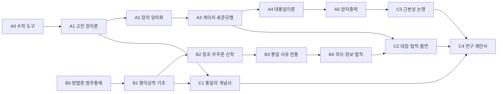
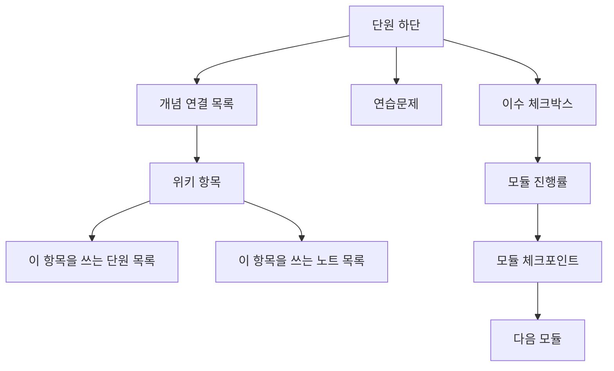

# 통일장이론 교육과정·사이트 통합 PRD

2026-09-18 · @Jun Lee

## 개요

이 사이트는 통일장이론을 두 갈래로 가르친다. 물리학 트랙(A)은 고전 장이론에서 양자중력 후보까지, 종교·철학 트랙(B)은 형이상학과 창조 신학에서 의식·정보 존재론까지 다루고, 통합 트랙(C)은 두 트랙을 이수한 학습자가 자기 가설을 검증 가능한 명제로 진술하도록 훈련한다.

이 구조를 택한 이유는 프로젝트의 목표가 종교와 과학을 통합적 관점에서 분석해 궁극의 원리를 정립하는 것이기 때문이다. 물리학만 가르치면 통합 관점의 언어가 없고, 철학만 가르치면 물리학 주장의 진위를 판별할 수 없다. 두 트랙을 따로 세우고 통합은 전용 모듈에서만 하는 이유는 범주 오류를 구조적으로 막기 위해서다. 물리 단원은 신학적 결론을 끌어내지 않고, 신학 단원은 물리 수식을 논거로 쓰지 않는다.

학습자는 학부 물리학 수준(다변수 미적분, 선형대수, 양자역학 1년, 특수상대론)을 전제하고, 도달점은 대학원 1년차 수준이다. 구체적으로는 게이지 이론 교과서를 혼자 읽고, 관련 arXiv 논문의 논지를 따라가며, 자기 연구 제안서를 쓸 수 있는 상태다.

MVP는 운영자 1인이 마크다운 파일만으로 운영하는 정적 사이트다. 읽기·검색·학습 경로 탐색만 제공하고, 회원·진도 저장·공동 편집은 2단계로 미룬다. 학습 진도는 브라우저 로컬 저장으로만 처리해 서버를 두지 않는다.

## 목표와 성공 지표

공개 6개월 내 진짜 목표는 하나다. 트랙 A의 모듈 1\~2와 트랙 B의 모듈 0\~1을 끝까지 쓰고, 그 내용을 사용해 통합 모듈 C1을 완성하는 것. 나머지 지표는 이 목표가 지키지고 있는지 보는 감지기다.

| 지표 | 정의 | 3개월 | 6개월 | 12개월 |
| --- | --- | --- | --- | --- |
| 공개 단원 수 | 검토 완료 상태로 배후된 학습 단원 | 14 | 34 | 72 |
| 수식 위키 항목 수 | 정의, 핵심 수식, 연결이 채운 항목 | 30 | 80 | 160 |
| 논문 요약 수 | arXiv ID 또는 DOI가 달린 한국어 요약 | 12 | 40 | 90 |
| 연구 노트 수 | 공개 상태의 날짜별 노트 | 24 | 70 | 150 |
| 연습문제 보유율 | 문제 2개 이상과 해설을 갖춘 단원 버줍 | 70% | 85% | 90% |
| 원전 연결율 | 트랙 B 단원 중 1차 문헌 직접 인용을 달은 버줍 | 80% | 90% | 95% |
| 주간 집필량 | 4주 이동평균, 단원과 노트 수 | 3 | 3 | 3 |
| 월간 순방문자 | 사이트 전역 | 80 | 500 | 2,000 |
| 단원 완독률 | 스크롤 90% 도달 세션 버줍 | 식정 전 | 40% | 50% |
| 트랙 완주자 | 모듈 마지만 단원에 도달한 세션 | 식정 전 | 20 | 120 |

콘텐츠 지표가 방문자 지표보다 우선한다. 단원 30개 문한에서는 방문자 수가 사이트 품질을 알려주지 않는다. 주간 집필량이 2주 연속 2 이하로 떨어지면 새 기능 작업을 줍룬다.

## 대상 사용자

1차 사용자는 운영자 자신이고, 설계의 기준은 두 번째 페르소나인 독학 학습자다. 세 번째와 네 번째는 트랙 하나만 소모하는 진입 경로로 다룬다.

| 페르소나 | 배경 | 진입 경로 | 핵심 니새 | 사이트에서 하는 일 |
| --- | --- | --- | --- | --- |
| 운영자·연구자 | 통일장이론을 지속적으로 연구하는 본인 | 지표 대시보드 | 노트·논문·수식을 한곳에서 연결 | 단원 집필, 위키 항목 링킬, 참고문헌 등록 |
| 독학 학습자 | 학부 물리·수학 이수, 대학원 수준을 목표 | 트랙 A 모듈 0 | 무엇을 어느 수서로 공부할지 | 트랙 순차 읽기, 연습문제 하기, 진도 체크 |
| 신학·철학 배경 독자 | 신학원·철학과 배경, 물리학 미이수 | 트랙 B 모듈 0 | 물리학 주장의 진위를 판별하고 싶다 | 트랙 B 전진, A는 개념 요지만 읽기 |
| 대학원생·연구자 | 이론물리 전공 | 논문 요약 검색 | 특정 논문의 핵심을 한국어로 뱠리 파악 | 위키 참조, 논문 요약 검색, BibTeX 내려받기 |
| 교양 관심자 | 과학 교양 독자 | 개념 에세이 | 최신 동향을 수식 없이 이해 | 개념 글과 용어 사전 읽기 |

교양 관심자를 위해 수식을 재는 법은 쓰지 않는다. 대시 단원 머리에 "수식 없는 요지" 박스를 3\~5문장으로 넣어 거기서 닫을 수 있게 하고, 본문은 원래 난이도로 쓴다.

트랙 B의 독자가 트랙 A를 전혀 살해하지 않고 통합 모듈로 가는 것은 허용하지 않는다. 통합 모듈 진입에는 A 모듈 1의 자기 평가 통과를 선수 조건으로 표기한다.

## 교육과정 설계 원칙

여섯 원칙이 단원 하나하나의 합부를 가른다. 이 원칙을 어긴 원고는 검토 상태를 올리지 않는다.

1. **적역적 분리.** 물리 단원은 물리적 주장만, 철학·신학 단원은 형이상학적 주장만 한다. 통합은 트랙 C에서만 하며, 트랙 C의 모든 주장은 어느 트랙의 어느 단원을 근거로 삼는지 명시한다.
2. **수식 이전에 동기.** 모든 단원은 "이 수식이 없었을 때 무엇을 설명하지 못했는가"로 시작한다. 역사적 맥랬 없는 수식 나열은 금지한다.
3. **유도는 생략하지 않는다.** 결과 수식만 제시하고 "유도는 교과서 어딘가에"로 넘기지 않는다. 분량이 넣지 않으면 단원을 나눠 쓴다.
4. **1차 문헌 직접 인용.** 트랙 B는 원전(아후이나스, 스피노자, 화이트헤드, 대장경, 주자 등)을 번역반으로도 반드시 직접 인용한다. 트랙 A는 가능한 한 원논문(Yang-Mills 1954, Higgs 1964, Georgi-Glashow 1974 등)을 가리킨다.
5. **산출물 있는 단원.** 모든 단원은 마치면 손으로 재현할 수 있는 것 하나를 남긴다. 계산 하나, 증명 하나, 또는 재진술 요지 하나.
6. **가설은 명제로.** 통합 트랙에서 학습자 자신의 생각을 쓸 때는 부정 가능한 문장으로 진술한다. 부정 가능하지 않은 명제는 형이상학적 전제로 분리 표기한다.

난이도는 세 계단으로 표기하고, 사이트에서 필터 기준이 된다.

| 계단 | 기준 | 예 |
| --- | --- | --- |
| 입문 | 학부 2학년 수학으로 닫힌다 | 라그랑지언 밀도와 오일러-라그랑주 방정식 |
| 중급 | 학부 4학년·대학원 1학기 수준 | 녹타 정리의 내부 대칭 버줍, 자발적 대칭붕사 |
| 고급 | 대학원 2학기 이후, 논문 읽기 전제 | 결합상수 러닝 2루프 계산, SO(10) 표현런 분해 |

검토 상태는 모든 글에 강제로 부여한다. `draft`는 배포에서 제외, `review`는 공개하되 머리에 경고 배너를 표시, `verified`는 출처 확인이 끝난 것이다. 물리 단원은 수식 유도를 다시 한번 직접 때리기 전에는 `verified`로 올리지 않는다.

## 커리큘럼 전체 지도

트랙 A 6개 모듈, 트랙 B 5개 모듈, 트랙 C 4개 모듈, 총 15개 모듈 79개 단원이다. 두 트랙은 독립적으로 진행하고, 트랙 C의 각 모듈은 양쪽에서 지정된 선수 모듈을 모두 마친 뒤에만 열린다.



실선은 선수 조건이다. C1은 A1과 B1을, C2는 A3과 B4를, C3은 A5를, C4는 C1\~C3을 모두 이수해야 열린다.

단원 하나는 읽기 60\~90분에 연습문제 60\~120분을 더해 잡았다. 주당 8시간을 쓰면 전체 이수에 약 15개월이 걸린다.

| 트랙 | 모듈 수 | 단원 수 | 예상 학습 시간 | 난이도 분포 |
| --- | --- | --- | --- | --- |
| A 물리학 | 6 | 44 | 132시간 | 입문 9 / 중급 22 / 고급 13 |
| B 종교·철학 | 5 | 23 | 52시간 | 입문 8 / 중급 12 / 고급 3 |
| C 통합 | 4 | 12 | 40시간 | 중급 5 / 고급 7 |
| 합계 | 15 | 79 | 224시간 | - |

집필 우선순위는 학습 순서와 다를 수 있다. A1 → B0 → B1 → C1 → A2 → A3 순으로 쓰면 공개 6개월 시점에 통합 모듈이 하나도 보이는 상태가 된다.

## 트랙 A · 물리학

트랙 A는 "장(field)이 무엇이고, 대칭이 왜 상호작용을 결정하며, 통일은 어느 수준까지 실제로 이루어졌는가"에 답하는 것을 목표로 한다. 모듈 0은 학부 수학을 장이론의 언어로 번역하는 속성 과정이고, 모듈 5에서 끝난다.

### A0 · 수학 도구 정비 (6단원, 입문)

| 단원 | 학습 목표 | 핵심 도구 |
| --- | --- | --- |
| A0-1 변분법과 작용원리 | 범함수의 극값 조건에서 오일러-라그랑주 방정식을 유도한다 | 범함수 미분, 경계항 처리 |
| A0-2 텐서와 지표 표기 | 반변·공변 지표를 구분하고 계량으로 올리고 내린다 | 아인슈타인 합 규약, 민코프스키 계량 |
| A0-3 미분형식과 외미분 | 맥스웰 방정식을 dF=0, d\*F=J로 다시 쓴다 | 쐐기곱, 호지 쌍대 |
| A0-4 군과 표현 | SU(2)와 SO(3)의 관계를 표현론으로 설명한다 | 리군, 리대수, 기약표현 |
| A0-5 리대수 실전 | su(2), su(3)의 생성자와 구조상수를 직접 쓴다 | 파울리·겔만 행렬, 카르탕 부분대수 |
| A0-6 함수해석 최소 도구 | 힐베르트 공간, 연산자, 스펙트럼을 장이론 용어로 정리한다 | 에르미트 연산자, 완전계 |

### A1 · 고전 장이론 (8단원, 입문·중급)

| 단원 | 학습 목표 | 핵심 수식 |
| --- | --- | --- |
| A1-1 입자에서 장으로 | 자유도가 무한개인 계의 라그랑지안 밀도를 세운다 | L = ∫ℒ d³x |
| A1-2 스칼라장과 클라인-고든 | 가장 단순한 장의 방정식을 작용에서 얻는다 | (□+m²)φ=0 |
| A1-3 뇌터 정리 I: 연속대칭 | 대칭에서 보존류를 구성하는 절차를 재현한다 | ∂\_μ j^μ=0 |
| A1-4 뇌터 정리 II: 시공간 대칭 | 에너지-운동량 텐서를 병진 대칭에서 유도한다 | T^{μν} |
| A1-5 맥스웰 이론의 공변 형식 | 4원 퍼텐셜로 맥스웰 이론을 재구성한다 | ℒ=-¼F\_{μν}F^{μν}-j\_μA^μ |
| A1-6 게이지 자유도의 최초 등장 | A\_μ의 중복성과 게이지 고정을 이해한다 | A\_μ→A\_μ+∂\_μΛ |
| A1-7 곡률과 측지선 | 등가원리에서 측지선 방정식까지 연결한다 | R^ρ\_{σμν}, 측지선 방정식 |
| A1-8 아인슈타인-힐베르트 작용 | 중력을 장이론의 한 사례로 정식화한다 | S=(1/2κ)∫R√(-g)d⁴x |

### A2 · 장의 양자화 (8단원, 중급)

| 단원 | 학습 목표 | 핵심 수식 |
| --- | --- | --- |
| A2-1 정준 양자화 | 장과 켤레운동량에 교환관계를 부여한다 | \[φ(x),π(y)\]=iδ³(x-y) |
| A2-2 생성·소멸 연산자와 입자 | 장의 들뜸이 입자로 해석되는 과정을 설명한다 | a†, a, 수 연산자 |
| A2-3 디랙 방정식 | 스피너장을 도입하고 반입자를 설명한다 | (iγ^μ∂\_μ-m)ψ=0 |
| A2-4 경로적분 정식화 | 진폭을 작용의 위상 합으로 다시 쓴다 | Z=∫Dφ e^{iS\[φ\]} |
| A2-5 파인만 규칙 | 상호작용 라그랑지안에서 꼭짓점과 전파함수를 읽는다 | 전파함수, 꼭짓점 인자 |
| A2-6 발산과 정칙화 | 고리 적분의 발산 구조를 분류한다 | 차원 정칙화 |
| A2-7 재규격화 | 물리량을 유한하게 만드는 절차를 한 사례로 완주한다 | 반대항, 재규격화 조건 |
| A2-8 재규격화군 | 결합상수가 에너지에 따라 흐르는 이유를 설명한다 | β(g)=μ dg/dμ |

### A3 · 게이지 이론과 표준모형 (8단원, 중급·고급)

| 단원 | 학습 목표 | 핵심 수식 |
| --- | --- | --- |
| A3-1 국소 게이지 대칭 | 전역 대칭을 국소화하면 왜 새 장이 필요한지 보인다 | D\_μ=∂\_μ-igA\_μ |
| A3-2 양-밀스 이론 | 비가환 게이지장의 장세기와 자기상호작용을 유도한다 | F\_{μν}=∂\_μA\_ν-∂\_νA\_μ-ig\[A\_μ,A\_ν\] |
| A3-3 자발적 대칭붕괴 | 골드스톤 정리와 남는 무질량 모드를 센다 | 멕시칸 해트 퍼텐셜 |
| A3-4 힉스 기작 | 게이지 보손이 질량을 얻는 과정을 계산한다 | m\_W=gv/2 |
| A3-5 전기약 통일 (GWS) | SU(2)\_L×U(1)\_Y에서 광자와 Z를 혼합각으로 얻는다 | θ\_W, m\_W=m\_Z cos θ\_W |
| A3-6 강력과 QCD | 색전하, 점근자유, 갇힘을 구분해 설명한다 | SU(3)\_c, β<0 |
| A3-7 표준모형 전체 조립 | 세대 구조, 유카와 결합, CKM 행렬을 한 표로 정리한다 | ℒ\_SM 전체 |
| A3-8 표준모형이 설명하지 못하는 것 | 중력, 중성미자 질량, 암흑물질, 계층 문제를 목록화한다 | 19개 자유 매개변수 |

### A4 · 대통일이론 (7단원, 고급)

| 단원 | 학습 목표 | 핵심 수식 |
| --- | --- | --- |
| A4-1 결합상수 러닝과 수렴 | 세 결합상수를 외삽해 수렴 에너지를 추정한다 | 10^15\~10^16 GeV |
| A4-2 SU(5) 대통일 | 한 세대 페르미온을 5̄+10에 담는다 | SU(5) ⊃ SU(3)×SU(2)×U(1) |
| A4-3 전하 양자화와 이상 소거 | 전하가 정수비인 이유를 표현론으로 설명한다 | 이상 소거 조건 |
| A4-4 양성자 붕괴 | X, Y 보손 교환에서 수명을 추정하고 관측 한계와 비교한다 | τ\_p ∝ M\_X⁴ |
| A4-5 SO(10)과 더 큰 군 | 우손 중성미자를 포함한 16 표현을 다룬다 | SO(10) ⊃ SU(5)×U(1) |
| A4-6 계층 문제 | 힉스 질량의 미세조정 문제를 정량화한다 | δm\_H² ∝ Λ² |
| A4-7 초대칭 개요 | 초대칭이 계층 문제와 결합상수 수렴에 주는 효과를 본다 | MSSM 입자 목록 |

### A5 · 양자중력과 완전한 통일 (7단원, 고급)

| 단원 | 학습 목표 | 핵심 내용 |
| --- | --- | --- |
| A5-1 중력 양자화의 벽 | 일반상대론이 재규격화 불가능한 이유를 차원 분석으로 보인다 | \[G\]=질량^-2 |
| A5-2 칼루차-클라인 | 5차원 중력에서 전자기학이 나오는 계산을 따라간다 | 5차원 계량의 분해 |
| A5-3 끈이론 개요 | 점입자를 끈으로 바꾸면 무엇이 달라지는지 정리한다 | 남부-고토 작용, D=10 |
| A5-4 초중력과 M이론 | 11차원 초중력과 이중성 관계망을 개괄한다 | 이중성, 11차원 |
| A5-5 고리양자중력 | 시공간 자체를 양자화하는 접근을 대조한다 | 스핀 네트워크, 면적 양자 |
| A5-6 홀로그래피와 AdS/CFT | 중력 이론과 게이지 이론의 대응을 진술한다 | Z\_grav = Z\_CFT |
| A5-7 역사적 통일 시도 | 아인슈타인, 바일, 칼루차의 시도가 실패한 지점을 규명한다 | 바일 게이지, 원격 평행성 |

A5-7은 트랙 C의 선수 단원이다. "통일 시도가 왜 실패했는가"를 물리적으로 정확히 알지 못하면 통합 트랙이 사변으로 흐른다.

## 트랙 B · 종교·철학·형이상학

트랙 B는 "궁극의 원리"라는 말이 무엇을 주장하는지 분석하는 트랙이다. 모듈 0을 제일 맨 앞에 둔 것은 의도적이다. 범주 오류를 진단하는 훈련을 먼저 하지 않으면 나머지 모듈이 유사 과학으로 변한다.

모든 단원은 원전 지정 부분을 갖는다. 번역반으로 읽는 것은 허용하되, 해설서만 읽고 원전을 건너뛰는 것은 허용하지 않는다.

### B0 · 방법론과 범주 통제 (5단원, 입문)

| 단원 | 학습 목표 | 지정 원전 |
| --- | --- | --- |
| B0-1 관계 유형론 | 갈듯·독립·대화·통합 네 유형을 구분하고 자기 입장을 한 유형으로 명시한다 | Barbour, ‘Religion and Science’ 1부 |
| B0-2 과학철학 기초 | 반증, 패러다임, 연구 프로그램 세 모형으로 한 이론을 평가한다 | Popper ‘추상과 반박’ 1장, Kuhn 1962 |
| B0-3 설명의 종량과 범주 오류 | 물리적 설명과 목적로적 설명을 섞은 문장을 지적해 고친다 | Ryle ‘The Concept of Mind’ 1장 |
| B0-4 양자 신미주의 별변 | 관촉자 효과·바국소성을 오용한 주장을 물리적으로 돌로 세운다 | Bell 1964, 단원 A2-1 여대 |
| B0-5 방법로적 자연주의의 경계 | 방법로적 자연주의와 형이상학적 자연주의를 분리해 쓴다 | Plantinga, ‘Where the Conflict Really Lies’ |

### B1 · 형이상학 기초 (5단원, 입문·중급)

| 단원 | 학습 목표 | 지정 원전 |
| --- | --- | --- |
| B1-1 존재론 기본 어휘 | 실재·속성·관계·사건을 구분해 장이론의 존재론을 진술한다 | 아리스토텔레스 ‘범주론’, ‘형이상학’ Z편 |
| B1-2 인과 | 4원인론, 흠의 규집성, 반사실적 인과를 대조한다 | ‘자연학’ II장, 흠 ‘인간로’ 7장 |
| B1-3 시간 | A이론과 B이론을 상대성이론의 블록 우주와 대조한다 | McTaggart 1908, 단원 A1-7 여대 |
| B1-4 양상과 필연 | 필연·우연·본질을 가능세계 언어로 정식화한다 | Kripke ‘Naming and Necessity’ 3강 |
| B1-5 근거지음과 근본성 | "A가 B를 근거짓는다"를 인과와 구분해 쓴다 | Schaffer, ‘On What Grounds What’ 2009 |

### B2 · 창조와 우주론 신학 (4단원, 중급)

| 단원 | 학습 목표 | 지정 원전 |
| --- | --- | --- |
| B2-1 무로부터의 창조 | 시간의 시작이라는 주장이 무엇을 부정하는가를 명시한다 | 아우구스티누스 ‘고백록’ 11권 |
| B2-2 지속적 창조와 보존 | 1차 원인과 2차 원인의 구분을 장이론에 적용해 본다 | 아퀸나스 ‘신학대전’ I q.104 |
| B2-3 칼람 우주론 논증과 반론 | 전제 두 가지의 반례를 우주로 모형에서 찾는다 | Craig ‘The Kalam Cosmological Argument’ |
| B2-4 미세조정과 다중우주 | 인류원리·선택효과·베이지 정식화를 주장과 반론 양쪽으로 쓴다 | Carter 1974, Rees ‘Just Six Numbers’ |

### B3 · 통일 사유의 전통 (5단원, 중급)

| 단원 | 학습 목표 | 지정 원전 |
| --- | --- | --- |
| B3-1 신플라톤주의의 일자 | 일자에서 다자로의 유출 도식을 정리한다 | 핀로티노스 ‘엔네아대스’ V, VI |
| B3-2 스피노자 실재 일원론 | 하나의 실재에 무한한 속성이 있다는 생각을 장 개념과 바꿔 본다 | ‘에티약’ 1부 정의·공리·정리 1-15 |
| B3-3 화이트헤드 과정철학 | 실재대신 사건을 기본 단위로 놓는 존재론을 장이론과 보도한다 | ‘과정과 실재’ I부, II부 1장 |
| B3-4 연기와 공 | 자성 부정이 관계 존재론으로 이어지는 논증을 재구성한다 | 나가르주나 ‘중로’ 1·24장 |
| B3-5 이기론과 기 | 이일분수와 기의 생성론을 장 개념의 사상사적 유사례로 다룬다 | 주돈이 ‘토극도설’, ‘주자어루’ 1권 |

### B4 · 의식·정보·법칙 (4단원, 중급·고급)

| 단원 | 학습 목표 | 지정 원전 |
| --- | --- | --- |
| B4-1 심신 문제와 범심론 | 어려운 문제와 결합 문제를 나눐 진술한다 | Chalmers 1995, Goff ‘Galileo’s Error’ |
| B4-2 정보 존재론 | "it from bit"이 주장하는 것과 증명하지 못하는 것을 가른다 | Wheeler 1989, Landauer 1961 |
| B4-3 수학적 실재론 | 수학이 물리학에서 작동하는 이유를 세 입장으로 설명한다 | Wigner 1960, Tegmark 2008 |
| B4-4 법칙의 지위 | 법칙이 서술인지 필연인지가 통일 문제에 물리는 차이를 보인다 | Lewis 1983, Armstrong ‘What Is a Law of Nature?’ |

B4-4는 트랙 C2의 직접 선수 단원이다. 법칙의 지위가 정해지지 않으면 "하나의 법칙으로 통일된다"는 목표 자신이 모호한 상태로 남는다.

## 트랙 C · 통합

트랙 C는 12단원이고, 산출물은 학습자 자신의 연구 제안서 하나다. 트랙 C의 모든 단원은 주장마다 근거 단원 ID를 보문 안에 표기한다. 근거 ID가 없는 문단은 검토에서 반려난다.

### C1 · 통일의 개념사 (3단원, 중급) · 선수 A1, B1

| 단원 | 학습 목표 | 산출물 |
| --- | --- | --- |
| C1-1 물리학에서 통일의 뜻 | 전자기 통일, 전기약 통일, 대통일에서 각각 무엇이 하나가 되었는지 대칭군 포함 관계로 진술한다 | 세 통일의 대칭군 계보 |
| C1-2 형이상학에서 일원론의 뜻 | 실재 일원론, 속성 일원론, 우선성 일원론을 구분한다 | 세 일원론 분류표 |
| C1-3 두 "하나"의 대조 | 물리적 통일과 형이상학적 일원론이 각각 주장하는 것과 주장하지 않는 것을 나눠 쓴다 | 대조표 + 500자 요지 |

### C2 · 대칭·법칙·필연 (3단원, 고급) · 선수 A3, B4

| 단원 | 학습 목표 | 산출물 |
| --- | --- | --- |
| C2-1 뇌터 정리의 형이상학적 독법 | 대칭이 존재론적 사실인지 서술 편의인지를 양쪽 입장에서 변햤한다 | 찬반 논증 양쪽 1,000자 |
| C2-2 대칭 붕괴와 우연성 | 진공 선택이 우연이라면 법칙의 필연성이 어디까지 남는지 견산한다 | 필연·우연 경계 지도 |
| C2-3 궁극 원리의 형식 조건 | 하나의 원리가 만족해야 할 네 조건을 격자로 놓는다 | 조건 목록과 자기 점검 |

C2-3의 네 조건은 이렇게 둔다. 무모순성, 하위 법칙을 도출하는 파생력, 자기를 전제하지 않는 무순환성, 적어도 한 지점에서 부정 가능한 부정 가능성.

### C3 · 근본성 논쟁 (3단원, 고급) · 선수 A5

| 단원 | 학습 목표 | 지정 문헌 |
| --- | --- | --- |
| C3-1 환원과 창발 | 유효장이론의 계산 구조가 지지하는 존재론을 명시한다 | Anderson 1972, Cao ‘Conceptual Developments’ |
| C3-2 최종 이론이라는 관념 | 설명의 종착점이 있다는 주장을 분석한다 | Weinberg ‘Dreams of a Final Theory’ |
| C3-3 물리적 완결성과 남는 질문 | 인과적 닫힘 논제를 진술하고 그런도 남는 질문을 유형화한다 | Kim ‘Physicalism, or Something Near Enough’ |

### C4 · 연구 제안서 (3단원, 고급) · 선수 C1, C2, C3

| 단원 | 학습 목표 | 산출물 |
| --- | --- | --- |
| C4-1 가설의 명제화 | 자신의 통일 구상을 P1\~Pn으로 분해하고 각 명제에 검증 유형을 붙인다 | 명제 분해표 |
| C4-2 검증 설계 | 물리적 명제는 어떤 관제나 계산으로 부정되는지, 형이상학적 명제는 어떤 논증이 지지하는지 짝는다 | 명제별 검증 경로 |
| C4-3 제안서 집필과 공개 | 사이트 연구 노트로 게재하고 반론을 직접 쓴다 | 제안서 본밀 |

제안서 합격 기준은 다섯 가지다. 분량 5,000\~8,000자, 명제 분해표 포함, 명제마다 물리적·형이상학적 분류 표기, 자기 주장에 대한 반론 3개 이상 지상, 인용 15건 이상.

제안서는 검토 상태 `review`로만 공개하고 `verified`로 올리지 않는다. 자기 가설은 원칙상 검증된 지식이 아니기 때문이다.

## 단원 템플릿과 콘텐츠 규격

트랙별로 세 가지 고정 템플릿을 쓰고, 섹션 이름과 순서는 바꾸지 않는다. 템플릿을 고정하는 이유는 집필 속도다. 번마다 구조를 고민하면 주 3편이 나오지 않는다.

| 섹션 | 트랙 A 물리 | 트랙 B 종교·철학 | 트랙 C 통합 |
| --- | --- | --- | --- |
| 1 | 한 줄 요지 | 한 줄 요지 | 다룰 질문 |
| 2 | 수식 없는 요지(접기, 3\~5문장) | 문제 상황 | 근거 단원 목록(필수) |
| 3 | 동기: 이 수식 없이 설명하지 못한 것 | 원전 발추(번역+원문+쇽수) | 물리학 쪽 사실 |
| 4 | 핵심 수식(번호 부여) | 논증 재구성(전제-결론 번호) | 형이상학 쪽 입장들 |
| 5 | 유도(생략 금지) | 반론과 재반론 | 대조와 정리 |
| 6 | 예제 1\~2개(풀이 포함) | 물리학과의 집점 표식(주장 금지) | 논증 가능한 것과 불가능한 것 |
| 7 | 연습문제 2\~5개(해설 접기) | 연습문제 2\~3개 | 과제와 산출물 규격 |
| 8 | 개념 연결(위키 항목) | 개념 연결 | 개념 연결 |
| 9 | 더 읽기(인용 키) | 더 읽기 | 더 읽기 |

분량은 상한을 둔다. 길어지면 단원을 나눠진다.

| 항목 | 기준 |
| --- | --- |
| 단원 본문 | 2,500\~6,000자. 6,000자 초과 시 분할 |
| 번호 부여 수식 | 단원당 12개 이하 |
| 연습문제 | 물리 2\~5개, 철학 2\~3개, 모든 문제에 해설 필수 |
| 위키 연결 | 단원당 3개 이상 |
| 인용 | 단원당 3건 이상, 트랙 B는 원전 1건 이상 필수 |
| 그림 | 직접 제작한 SVG만. 교과서 스캔 금지 |

수식 규칙은 네 가지다. 본문에서 다시 부를 수식은 `$$...$$`에 `\tag{}`로 번호를 달고, 한 번만 나오는 식은 인라인으로 쓴다. 모든 기호는 처음 나올 때 한글로 이름을 부여한다. 텐서 지표 규약은 사이트 전역에서 하나로 고정하고 위키에 규약 항목을 둔다. 연산자와 장을 구분하는 표기(모자, 볼드)도 전역 고정이다.

한국어 용어는 한국물리학회 물리학 용어집을 1순위 기준으로 삼고, 용어집에 없는 말은 위키에 항목을 만들어 한글 번역과 원어를 확정해 넣는다. 철학·신학 용어는 한국철학회·한국종교학회 통용례를 따르고, 원어 병기를 한 번 한다.

## 평가와 학습 진도

평가는 전부 자기 평가다. 사이트는 정답을 저장하지 않고 채점하지도 않는다. 학습자가 자기 글을 루부릭에 대여 보고 스스로 통과 여부를 정한다.

문항은 여섯 유형을 쓴다. 물리 단원은 1\~3형, 철학 단원은 4\~6형, 통합 단원은 전 유형을 섮는다.

| 유형 | 물어보는 것 | 예 |
| --- | --- | --- |
| 1 유도형 | 수식을 전제에서 직접 만들 수 있는가 | 주어진 라그랑지안에서 운동방정식을 얻어라 |
| 2 계산형 | 수를 끝까지 내는가 | 혼합각 값에서 Z 보손 질량을 구하라 |
| 3 개념 진술형 | 수식 없이 다시 설명하는가 | 게이지 대칭이 왜 필수인지 300자로 |
| 4 논증 재구성형 | 원전의 논증을 전제-결론으로 재구성하는가 | 에티카 1부 정리 14를 번호 논증으로 |
| 5 반론 작성형 | 가장 센 반론을 직접 만드는가 | 미세조정 논증에 대한 반례를 하나 |
| 6 오류 진단형 | 섞인 문장을 가려내는가 | 이 단립에서 범주 오류를 찾아 지적하라 |

모듈을 마칠 때마다 체크포인트가 하나 있다. 물리 모듈은 문제 5개 세트, 철학 모듈은 1,500자 글 하나, 통합 모듈은 산출물 제출이다. 통과 기준은 루부릭 3수준 이상이다.

| 수준 | 물리 모듈 | 철학·통합 모듈 |
| --- | --- | --- |
| 1 부족 | 수식을 보면서만 재현한다 | 원전 인용 없이 인상을 쓴다 |
| 2 부분 | 유도 경로는 알지만 중간에서 마혀다 | 논증을 워약하나 전제를 모두 찾지 못한다 |
| 3 통과 | 백지에서 유도하고 가정을 말한다 | 전제-결론을 번호로 짜고 의존 관계를 보인다 |
| 4 숙달 | 다른 가정에서 다시 유도해 본다 | 자기 반론을 만들고 그에 다시 답한다 |

진도는 브라우저 `localStorage`에만 저장한다. 단원마다 이수 표시 체크박스를 달고, 트랙 목록 페이지와 모듈 페이지에 진행률을 보여준다. 서버가 없으므로 기기를 바꾸면 기록은 따라오지 않는다. JSON 내보내기와 가지고오기 버튼을 하나 둔다.

해설은 정답만 주지 않는다. 모든 해설은 흔한 오류 하나를 명시하고, 그 오류가 왜 그럴리한지까지 쓴다.

## 사이트 핵심 기능

MVP는 P0 기능 12개다. 모든 P0 기능은 운영자가 마크다운 파일과 front matter만 쓰면 동작해야 하고, 서버나 어드민 화면이 필요한 기능은 P0에 넣지 않는다.

| 기능 | 설명 | 우선순위 |
| --- | --- | --- |
| 트랙 3종 네바게이션 | A·B·C 트랙을 동급으로 노출하고 트랙별 색을 다르게 한다 | P0 |
| 모듈·단원 순차 탐색 | 이전·다음 단원 이동, 현재 위지 표시 | P0 |
| 선수 조건 배너 | 단원 상단에 선수 단원 ID를 링크로 표시. 트랙 C는 항상 표시 | P0 |
| 수식 렌더링 | KaTeX 바드 시 SSR, 번호 방정식과 상호 참조 | P0 |
| 수식 없는 요지 박스 | 단원 머리에 여닫을 수 있는 3\~5문장 우선 박스 | P0 |
| 원전 인용 박스 | 번역·원문·출처를 한 짝으로 보이는 전용 컴포넌트 | P0 |
| 연습문제 접기 | 문제는 항상 보이고 해설은 사용자가 여는 구조 | P0 |
| 개념 위키 | 항목 페이지(정의, 핵심 수식, 한·영 용어, 관련 항목), 역링크 표시 | P0 |
| 전체 검색 | 제목·본문·태그 대상 클라이언트 검색(Pagefind). 한국어 토키나이징 한계 인지 | P0 |
| 참고문헌 DB | BibTeX 한 파일, 인용 키로 각주 자동 생성 | P0 |
| 연구 노트·논문 요약 | 날짜·태그 목록과 상세, draft 상태는 배포 제외 | P0 |
| 반응형 + 다크 모드 | 모바일에서 수식이 잽히지 않게 가로 스크롤 컨테이너 처리 | P0 |
| 진도 체크박스 | 단원 이수 표시와 모듈 진행률, localStorage 저장 | P1 |
| 명제 분해표 컴포넌트 | P1\~Pn과 검증 유형을 표로 쓰는 전용 표기 | P1 |
| 한·영 용어 대조 사전 | 위키에서 자동 생성하는 용어 색인 페이지 | P1 |
| RSS 피드 | 연구 노트·논문 요약·새 단원 피드 | P1 |
| 인쇄·PDF 내보내기 | 모듈 단위 인쇄 CSS | P1 |
| 개념 그래프 시각화 | 위키 항목 연결을 그래프로. 트랙별 색 구분 | P1 |
| 댓글·토로 | 자체 서버 없이 giscus 연동 | P2 |
| 회원·진도 동기화 | 기기 간 진도 동기화, 제출물 보관 | P2 |
| 공동 편집 | 다수 저자 노트와 검토 흐름 | P2 |

수식 없는 요지 박스와 원전 인용 박스는 단순한 UI가 아니라 교육과정 원칙 2번과 4번을 강제하는 장치다. 두 컴포넌트가 비어 있으면 배포 전 검사가 실패하게 만들어 둔다.

## 정보 구조와 주요 화면

URL은 트랙 → 모듈 → 단원 삼 계증을 그대로 드러낸다. 단원 ID가 URL에 들어가므로 트랙 C에서 근거 단원을 링킬하기 쉬워진다.

| 경로 | 화면 | 핵심 구성 요소 |
| --- | --- | --- |
| `/` | 홈 | 사이트 목표 3문장, 트랙 3장 진입 카드, 최신 노트 5개, 진도 있으면 이어보기 |
| `/learn/` | 트랙 전체 지도 | 모듈 의존 그래프, 난이도·트랙 필터, 단원 수와 진행률 |
| `/learn/physics/` | 트랙 A 목록 | 모듈 A0\~A5 카드, 각 모듈 단원 목록 토글 |
| `/learn/physics/a1/` | 모듈 개요 | 모듈 목표, 단원 목록, 선수 모듈, 체크포인트 링크 |
| `/learn/physics/a1/a1-3/` | 단원 | 템플릿 9섹션, 이전·다음, 우상단 목차, 이수 체크박스 |
| `/learn/philosophy/...` | 트랙 B | 동일 구조, 원전 인용 박스 포함 |
| `/learn/synthesis/...` | 트랙 C | 동일 구조, 근거 단원 배너 상시 노출 |
| `/wiki/` | 위키 색인 | 가나다·알파벳 색인, 트랙 필터, 그래프 뷰 진입 |
| `/wiki/noether-theorem/` | 위키 항목 | 정의, 핵심 수식, 한·영 용어, 관련 항목, 역링크 목록 |
| `/research/notes/` | 연구 노트 목록 | 날짜 역순, 태그 필터, 검토 상태 배지 |
| `/research/papers/` | 논문 요약 목록 | arXiv ID, 연도, 주제 태그, 원문 링크 |
| `/bib/` | 참고문헌 | BibTeX 전체 목록, 개별 키 복사, 사이트 내 역인용 |
| `/glossary/` | 한·영 용어 대조 | 위키에서 자동 생성, 원어·번역·항목 링크 |
| `/search/` | 검색 | 입력창, 유타입 결과, 유형별 그룹핑 |
| `/about/` | 사이트 소개 | 목표, 검토 상태 정의, AI 보조 사용 공지, 연량망 |

단원 화면은 사이트에서 가장 자주 읽힌다. 내용을 뒤집지 않고 읽는 상황만 다룬다.



위키 항목이 통합의 축이다. 같은 항목을 트랙 A 단원과 트랙 B 단원이 동시에 가리킬 때, 역링크 목록이 두 트랙을 한 화면에 모으는 유일한 지점이다.

## 콘텐츠 스키마

콘텐츠는 다섯 종류다. 단원, 위키 항목, 연구 노트, 논문 요약, 개념 글. 모든 파일은 front matter를 갖고, 바드 시에 스키마 검사를 통과하지 못하면 바드가 실패한다.

단원(`src/content/lessons/`)은 필드가 가장 많다. 교육과정 원칙을 가장 많이 거는 유형이기도 하다.

```yaml
id: a1-3                  # 전역 고유, 트랙 C가 근거로 가리키는 키
track: physics            # physics | philosophy | synthesis
module: a1
order: 3
title: 뇌터 정리 I · 연속대칭
level: intermediate      # intro | intermediate | advanced
status: review           # draft | review | verified
prereq: [a1-1, a1-2]     # 단원 id 배열
wikiRefs: [noether-theorem, conserved-current, lagrangian-density]
citations: [Noether1918, Goldstein2002, Peskin1995]
estMinutes: 150
author: Jun Lee
created: 2026-10-14
updated: 2026-10-20
aiAssisted: outline      # none | outline | draft | translation
```

트랙 B 단원은 여기에 원전 정보를 더 올린다. 트랙 C 단원은 `groundedIn`을 반드시 갖는다.

```yaml
# 트랙 B 추가 필드
primarySources:
  - work: 에티카 1부
    author: 스피노자
    locus: 정리 14–16
    edition: 개정판 2014

# 트랙 C 추가 필드
groundedIn: [a3-1, a3-3, b4-4]   # 1개 이상 필수, 검사 대상
claimType: comparative           # comparative | conceptual | proposal
```

나머지 네 종류는 필드가 단순하다.

| 종류 | 경로 | 핵심 필드 |
| --- | --- | --- |
| 위키 항목 | `content/wiki/` | `slug`, `titleKo`, `titleEn`, `aliases[]`, `tracks[]`, `related[]`, `citations[]`, `status` |
| 연구 노트 | `content/notes/` | `date`, `title`, `tags[]`, `wikiRefs[]`, `status`, `aiAssisted` |
| 논문 요약 | `content/papers/` | `arxivId` 또는 `doi`(둘 중 하나 필수), `authors[]`, `year`, `titleOriginal`, `summaryKo`, `wikiRefs[]`, `bibKey` |
| 개념 글 | `content/essays/` | `title`, `date`, `audience: general`, `wikiRefs[]` |

검사 규칙은 다섯 가지다. 사람이 눈으로 지키는 조항은 하나도 없고, 전부 바드 시에 자동 확인한다.

1. `prereq`와 `groundedIn`의 모든 id가 실제로 있어야 한다.
2. `wikiRefs`의 모든 slug가 위키에 있어야 하고, 단원당 3개 이상이어야 한다.
3. `citations`의 모든 키가 BibTeX 파일에 있어야 한다.
4. 트랙 B 단원은 `primarySources`가 1개 이상, 트랙 C 단원은 `groundedIn`이 1개 이상이어야 한다.
5. `prereq` 그래프에 사이클이 없어야 한다.

`aiAssisted` 필드는 단원 하단에 그대로 표시한다. 사이트 소개 페이지에 사용 범위를 명시하고, 수식 유도와 원전 번역은 사람이 검사한 뒤에만 `verified`로 올린다.

## 비기능 요구사항

수식이 많은 단원도 모바일에서 2초 안에 읽기 시작할 수 있어야 하고, 콘텐츠는 벤더 종속 없이 일반 파일로 남아야 한다.

| 영역 | 요구사항 |
| --- | --- |
| 수식 렌더링 | 빌드 시 서버 쪽에서 렌더링. 깨지는 수식은 빌드 오류로 처리. 번호와 상호참조는 M1에서 실증 필수 |
| 성능 | Lighthouse 성능 90 이상, 단원 페이지 최초 로드 200KB 이하(폰트 제외). 수식 200개 페이지도 같은 기준 |
| 이동성 | 모든 글은 Markdown 또는 MDX + front matter. 다른 도구로 옮길 때 변환 스크립트가 필요 없어야 함 |
| 진도 데이터 | localStorage 한 키에 JSON으로 모음. 스키마 버전 필드 필수, 내보내기와 가져오기 지원, 읽기와 쓰기 모두 try/catch |
| 수식 접근성 | 수식마다 MathML 또는 대체 텍스트 제공. 스크린 리더가 기호를 읽을 수 있어야 함 |
| 일반 접근성 | 키보드 탐색, 본문 대비 WCAG AA, 접기 요소에 키보드 포커스 링 표시 |
| 한국어 조판 | 본문 폰트는 Pretendard 계열, 수식과 글자 높이를 맞춤. word-break는 keep-all, 한글과 수식 사이 여백 자동 조정 |
| 원문 표기 | 트랙 B 원전 인용은 라틴 문자, 그리스 문자, 한문, 산스크리트가 모두 깨지지 않는 폰트 보장 |
| SEO | 페이지별 제목과 설명 메타, sitemap.xml, Open Graph 이미지 자동 생성, 단원에 Article 구조화 데이터 |
| 보안 | 정적 사이트. HTTPS 강제, 외부 스크립트는 댓글 위젯 하나로 제한 |
| 버전 관리 | 콘텐츠와 코드를 같은 Git 저장소에. 글 수정 이력은 Git 로그로 대신함 |
| 오프라인 | 단원과 모듈을 인쇄 CSS로 PDF 내보내기 가능. 수식이 페이지 경계에서 잘리지 않아야 함 |

수식 번호와 상호참조는 가장 이른 시점에 판단해야 한다. 이 사이트는 긴 유도를 다루므로, 나중에 이 기능이 없다는 것을 알게 되면 단원을 전부 다시 손대야 한다. M1에서 A1-3 단원을 시험 산출물로 만들어 번호, 상호참조, 인용, 위키 링크를 한꺼번에 검증한다.

## 기술 스택

정적 사이트 생성기에 마크다운 콘텐츠와 무료 호스팅을 얹는 조합이다. 운영 보용 0원에서 시작하고, 회원 기능을 붙이기 전에는 서버를 두지 않는다.

| 계소 | 제안 | 선택 이유 | 대안 |
| --- | --- | --- | --- |
| 사이트 생성 | Astro | 정적 우선, 콘텐츠 컸렉션으로 front matter 스키마 검사, 자바스킬립트 출력 최소 | Next.js(2단계 회원 기능 시), Hugo |
| 콘텐츠 형식 | MDX + front matter | 원전 인용 박스, 명제 분해표 같은 전용 컴포넌트를 본문에 넣으려면 필수 | 순수 Markdown |
| 스키마 검사 | Astro Content Collections + Zod | 단원 id 참조, 위키 slug, 인용 키를 바로 검사 가능 | 자제 스크립트 |
| 수식 | KaTeX(remark-math + rehype-katex) | 버드 시 SSR, MathJax보다 보긍함 | MathJax 3(더 넓은 LaTeX 명령 지원) |
| 스타일 | Tailwind CSS | 다크 모드와 반응형 처리 간단, 트랙별 토큰 관리 용이 | 일반 CSS |
| 검색 | Pagefind | 버드 시 인덱스 생성, 서버 필요 없음 | Algolia DocSearch |
| 참고문헌 | BibTeX 파일 + citation-js | 연구자 표준 형식, Zotero 내보내기와 호환 | YAML 수기 관리 |
| 개념 그래프 | Cytoscape.js 또는 버드 시 정적 SVG 생성 | 위키 링크를 그래프로 그리기 | D3 force |
| 댓글 | giscus(GitHub Discussions) | 자체 서버 없이 처리 | Disqus |
| 배포 | Cloudflare Pages 또는 Vercel | Git push 자동 배포, 무료 플랜으로 충분 | GitHub Pages |
| 저장소 | GitHub(현재 UFT 저장소) | 이미 생성되어 있음 | - |

마크다운 전용 컴포넌트는 일곱 개를 만들어 둔다. `Gist`(수식 없는 요지 박스), `Source`(원전 인용), `Problem`(문제와 해설 접기), `Claims`(명제 분해표), `Prereq`(선수 배너), `Grounds`(트랙 C 근거 배너), `Eq`(번호 방정식과 상호참조). 이 일곱 개가 교육과정 원칙을 태그 수준에서 강제하는 장지다.

데이터베이스와 인증은 MVP에 도입하지 않는다. 기기 간 진도 동기화가 필요해지는 2단계에 Supabase 같은 관리형 서버를 붙이는 방식을 검토한다.

## 범위 외와 향후 로드맵

MVP는 읽기와 검색, 그리고 기기 하나에 머뼈는 진도 표시까지만 제공한다. 계정이 필요한 기능은 전부 제외한다.

**MVP 범위 외**

- 회원 가입, 로그인, 기기 간 진도 동기화
- 자동 채점과 제출물 보관
- 온라인 수식 편집기와 공동 편집
- 유료 강의와 결제
- 영어 버전과 다국어
- 시뮬레이션과 계산 노트북 실행 환경
- 모바일 앱

통합 트랙을 민감하게 다룬다는 이유로 한 가지를 더 범위 외로 둔다. 트랙 C에서 다를 주장을 사이트가 편집자 역할로 재단하지 않는다. 독자 기고를 여는 것은 3단계 이후의 문제다.

| 단계 | 내용 | 전제 조건 |
| --- | --- | --- |
| 2단계 상태 유지 | 회원 가입, 기기 간 진도 동기화, 제출물 보관, 댓글, 개념 그래프 | 공개 단원 34개 도달, 트랙 C 모듈 1개 이상 공개 |
| 3단계 공동 연구 | 다수 저자 노트, 검토 흐름, 외부 기고, 제안서 상호 반론 | 월간 방문자 500목 이상, 기고 의사자 3명 이상 |
| 4단계 계산 도구 | 번호 방정식을 SymPy 들과 연동, 브라우저 노트북, 결합상수 러닝 계산기 | 3단계 정상화 |
| 5단계 영어 버전 | 트랙 C 모듈부터 영어 변역, arXiv 상호 참조 | 트랙 C 전체 공개 |

단계를 넘어가는 조건은 전부 콘텐츠 기준이다. 기능을 앞어서 만들면 쓸 내용이 없는 상태로 관리 부담만 늘는다.

## 마일스톤

12주 일정으로 2026-12-11에 공개 배포한다. 개발보다 집필이 오래 걸리므로 3주짜부터 단원을 쓰기 시작하고, 트랙 A와 트랙 B를 번갈아 쓴다.

| 마일스톤 | 완료 기준 | 목표일 |
| --- | --- | --- |
| M1 기반 구조 | Astro 프로젝트, 삷 종 컴포넌트, 콘텐츠 스키마 검사, 배포 파이프라인. A1-3을 시험 단원으로 끝까지 만들어 번호·상호참조·인용·위키 링크 실증 | 2026-10-09 |
| M2 세 트랙 템플릿 | 트랙 A·B·C 단원 템플릿, 선수·근거 배너, 위키 역링크, 검색, 반응형, 다크 모드 | 2026-10-30 |
| M3 콘텐츠 초도 | A0 6단원, A1 8단원, B0 5단원 전부 공개. 위키 30항목, 논문 요약 12건, 참고문헌 연동 완료 | 2026-11-27 |
| M4 공개 배포 | 도메인 연결, SEO·RSS, 사이트 소개 페이지(AI 보조 공지 포함), B1 절반 이상, 트랙 전체 지도 화면 | 2026-12-11 |
| M5 진도 기능 | 진도 체크박스, 모듈 진행률, JSON 내보내기, 인쇄 CSS | 2027-01-15 |
| M6 통합 모듈 개시 | C1 3단원 공개. 명제 분해표 컴포넌트 사용 개시 | 2027-02-19 |
| M7 6개월 점검 | 성공 지표 확인, 2단계 진입 여부 결정 | 2027-03-18 |

주별 집필 계획은 이렇게 단순하게 둔다. 단원 2개 또는 단원 1개 + 노트 2개, 위키 3항목, 논문 요약 1건. 4주 이동평근이 주 3건 아래로 떨어지면 그 시점의 기능 작업을 전부 주리고 집필로 돌아온다.

M1의 시험 단원을 A1-3(뇌터 정리)로 잡은 것은 이 단원이 사이트의 기술적 난이도를 한꺼번에 드러내기 때문이다. 긴 유도, 번호 방정식 여럿 개, 상호참조, 위키 항목 세 개, 원논문 인용이 한 단원에 다 들어있고, 트랙 C의 가장 중요한 근거 단원이기도 하다.

## 리스크와 열린 질문

가장 큰 리스크는 기술이 아니라 집필 속도다. 두 번째는 통합 트랙이 유사과학으로 읽힐 위험이고, 이것은 사이트 전역의 신뢰도를 가장 크게 움직이는 변수다.

| 리스크 | 영향 | 대응 |
| --- | --- | --- |
| 집필이 일정을 따라가지 못함 | 배포는 되지만 사이트가 비어 보인다 | 템플릿 고정, 주 3건 목표, 4주 이동평근이 기준 아래로 떨어지면 기능 작업 중단 |
| 통합 트랙이 유사과학으로 읽혔 | 물리 트랙의 신뢰도까지 깎인다 | B0 모듈을 진입 조건으로 고정, `groundedIn` 검사, 트랙 C는 `verified` 부여 없음 |
| 원전 번역반 인용 저작권 | 법적 문제 | 번역반 인용은 단원당 200자 이하로 제한, 출토 명시, 긴 대문은 원문 + 자기 번역 |
| 교과서 그림·논문 본문 인용 | 법적 문제 | 그림은 직접 제작한 SVG만, 논문은 요약과 링크만 |
| 수식 번호·상호참조가 KaTeX에서 까다로움 | 긴 유도 글의 가독성 상승 | M1에서 A1-3으로 실증, 부족하면 MathJax 3으로 전환 |
| 검색이 한국어 조사를 못 자름 | 검색 결과 누락 | 태그와 제목 가중치로 보완, 위키 `aliases`에 변형형 등록, 실패 시 Algolia 검토 |
| 오류 있는 물리 내용 공개 | 사이트 신뢰도 상승 | 검토 상태 배너, 유도는 다시 한번 지우고 푸는 생산물로 검사 뒤에만 `verified` |
| 트랙 B 전문 검토자 없음 | 철학·신학 내용의 정확도를 자가 판정 | 3단계 전에 전공자 1명 검토 합의, 그전에는 트랙 B도 `review`에서 정지 |
| 통합 모듈의 독자 산산함 | 방문자 지표 정적 | 물리만 읽는 독자와 철학만 읽는 독자를 모두 정상 경로로 인정, 트랙 완주자를 별도 지표로 분리 |

**열린 질문**

- [ ] 사이트 이름과 도메인은 무엇으로 할까. 통일장이론을 직접 내걸까, 더 넓은 이름을 쓸까.
- [ ] 트랙 B의 1차 전통을 어느 쪽으로 둘까. 기독교 신학 중심인가, 동아시아 전통과 동등 분량인가.
- [ ] 연구 노트를 미공개로 두는 옵션이 필요한가. `draft` 상태만으로 충분한가.
- [ ] 자기 가설(C4 산출물)을 사이트 전면에 노출할까, 연구 노트 안에만 둘까.
- [ ] 한국물리학회 용어집을 어듀에서 어느까지 따를까. 생소한 역어를 그대로 쓸까.
- [ ] AI 보조 표기를 어떤 방식으로 보여줄까. 단원 하단 배지만으로 충분한가.
- [ ] 연습문제 해설을 전부 통짜로 노출할까, 생각할 시간을 가로막을까.
